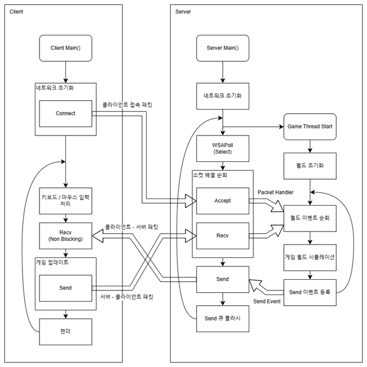

# 2024 네트워크게임프로그래밍 프로젝트

## 개요
* 2023 년 2 학기 컴퓨터그래픽스 프로젝트 “Cave Game” (최재혁, 김도엽 제작)
  * 1-인칭 어드벤처 샌드박스 게임
  * OpenGL 그래픽스 라이브러리 사용
  * 기존 게임 ‘Minecraft’ 의 재구현
  * 다양한 텍스쳐를 가진 정육면체 블럭으로 이루어진 월드 맵
  * 절차적 생성 알고리즘(3D Perlin Noise 등)을 이용한 랜덤 지형 생성
  * 플레이어가 블럭을 설치하거나 제거할 수 있는 샌드박스 기능 제공
* 서버 – 클라이언트 간 네트워크 통신에 TCP 사용
* 작업 IDE : Microsoft Visual Studio
* 버전 관리 : GitHub 

## High-Level Design
### 프로그램 흐름

### 클래스 개요

## 일정
### 1주차
#### 10/31 (목)
- [x] 김도엽: 프로젝트 깃허브 초기구성
#### 11/01 (금)
- [x] 김도엽: InitClient()
- [x] 최재혁: InitServer()
#### 11/02 (토)
- [x] 최재혁: IORoutine()
### 2주차
#### 11/03 (일)
- [x] 최재혁: OnAccept(), OnDisconnect(), OnRecv()
#### 11/04 (월)
- [x] 김도엽: AddObject(), RemoveObject(UINT), IORoutine()
- [x] 최재혁: HandlePacket<T>()
#### 11/05 (화)
- [x] 김도엽: FindObject(), OnRecv()
- [x] 최재혁: Handle<T>()
#### 11/06 (수)
- [x] 김도엽: Send()
#### 11/07 (목)
- [x] 김도엽: ServerObject, Init(), AddProtocol()
- [x] 최재혁: PostWorldUpdate(), LFQueue<T>
#### 11/08 (금)
- [x] 김도엽: SyncMovement(), HandlePacket(), HandleInvalid()
- [x] 최재혁: GameWorld
#### 11/09 (토)
- [x] 최재혁: ObjectComponent

### 3주차
#### 11/10 (일)
#### 11/11 (월)
- [x] 김도엽: 오브젝트 생성 패킷
- [x] 최재혁: 로그인 패킷, 월드 스레드 – 통신 스레드 간 통신 디버깅 (~11/13)
#### 11/12 (화)
- [x] 최재혁: 입/퇴장 패킷
#### 11/13 (수)
- [x] 김도엽: 이동 패킷
- [x] 최재혁: 플레이어 처치 패킷
#### 11/14 (목)
- [x] 김도엽: 블럭 설치 패킷
- [x] 최재혁: 몬스터 처치 패킷
#### 11/15 (금)
- [x] 김도엽: 블럭 파괴 패킷
- [x] 최재혁: FindObject(), AddObject(), RemoveObject()
#### 11/16 (토)
- [x] 최재혁: 몬스터, FSM

### 4주차
#### 11/17 (일)
#### 11/18 (월)
- [x] 최재혁: 몬스터 상태 - Idle
#### 11/19 (화)
- [x] 김도엽: 투사체 생성 패킷, 아이템 사용 패킷
#### 11/20 (수)
- [x] 김도엽: 인벤토리 시스템 (~11/22)
- [x] 최재혁: 보스 소환 패킷
#### 11/21 (목)
- [x] 김도엽: 게임 클리어 패킷
- [x] 최재혁: 동기화 테스트
#### 11/22 (금)
- [x] 최재혁: 몬스터 상태 - Chase
#### 11/23 (토)
- [x] 최재혁: A* Algorithm

### 5주차
#### 11/24 (일)
#### 11/25 (월)
- [x] 김도엽: 보스몬스터 리소스 준비 (~11/26)
#### 11/26 (화)
#### 11/27 (수)
- [x] 김도엽: 플레이어 / 몬스터 처치 애니메이션
- [x] 최재혁: 게임 오버, HP 및 피격 (~11/28)
#### 11/28 (목)
- [x] 김도엽: 체력 UI
- [x] 최재혁: 충돌체 및 충돌검사, 화살 추가
#### 11/29 (금)
- [ ] 김도엽: 보스 UI, 클라이언트 보스몬스터 소환 이벤트
- [ ] 최재혁: 화살 동기화, 체력 시스템
#### 11/30 (토)
- [ ] 김도엽: 아이템 사용효과
- [ ] 최재혁: 아이템 획득 처리
### 6주차
#### 12/01 (일)
- [ ] 김도엽: 보스 공격 이펙트
- [ ] 최재혁: 보스 공격 투사체 처리
#### 12/02 (월)
- [ ] 김도엽: 게임 클리어 UI, 게임 클리어 이벤트 처리 (~12/3)
- [ ] 최재혁: 게임 클리어 (~12/3)
#### 12/03 (화)
#### 12/04 (수)
- [ ] 테스트 및 최종 제출
#### 12/05 (목)
#### 12/06 (금)
#### 12/07 (토)
